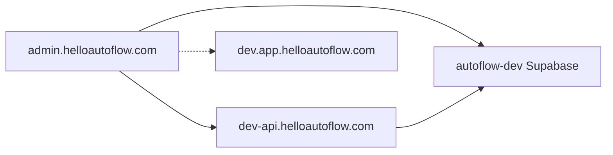

# Admin Console — setup and operations

This document covers the platform admin console for **dev** (`admin.helloautoflow.com` on the dev stack).

## Dev stack

| Layer | URL / project |
|---|---|
| Admin UI | `https://admin.helloautoflow.com` (also `https://admin-dev.helloautoflow.com`) |
| API | `https://dev-api.helloautoflow.com` (`autoflow-api-dev` on Fly) |
| Auth + DB | **autoflow-dev** Supabase (`pjbpcfmidpxplcrwpcyk`) |
| Customer dashboard | `https://dev.helloautoflow.com` / `https://dev.app.helloautoflow.com` |

Sign in with credentials that exist in **autoflow-dev** — the same account you use on the dev customer dashboard. Production dashboard credentials will not work.



## Architecture

- **Frontend** lives in `admin/` and deploys to Cloudflare Pages via
  `.github/workflows/admin-cloudflare-pages.yml` when `admin/**` changes on `dev`.
  Build env: `VITE_API_BASE_URL=https://dev-api.helloautoflow.com`, dev Supabase keys.
- **Backend** lives under `src/adminConsole/` and is mounted at
  `/api/admin-console/*` from `src/app.ts`. The public impersonation-verify
  endpoint is at `/api/impersonation/verify` (NOT under the admin gate).
- **Audit log** is `platform_admin_audit_log` (migration 059) — cross-tenant,
  append-only at the RLS level.
- **Cross-tenant reads** go through SECURITY DEFINER lookup functions in
  migration 060; they gate on the session GUC `app.is_platform_admin`.

## Required environment variables (dev)

### API (`autoflow-api-dev` / [`fly.api.dev.toml`](fly.api.dev.toml))

| Name | Purpose |
|---|---|
| `SUPABASE_URL` | autoflow-dev project URL |
| `SUPABASE_SERVICE_ROLE_KEY` | Service-role key (**API only**, never on the frontend) |
| `IMPERSONATION_TOKEN_SECRET` | Signs impersonation tokens |
| `AUTOFLOW_STAFF_USER_IDS` | (optional bootstrap) comma-separated user IDs treated as platform admin without the DB flag |
| `ADMIN_APP_URL` | `https://admin.helloautoflow.com` — magic-link MFA redirects here when `return_to=admin` |
| `ALLOWED_ORIGINS` / `MFA_ORIGIN` | Must include `https://admin.helloautoflow.com` and `https://admin-dev.helloautoflow.com` (already in dev toml) |

### Admin app (Cloudflare Pages dev build / Infisical `dev`)

| Name | Purpose |
|---|---|
| `VITE_SUPABASE_URL` | autoflow-dev |
| `VITE_SUPABASE_PUBLISHABLE_KEY` | autoflow-dev |
| `VITE_API_BASE_URL` | `https://dev-api.helloautoflow.com` |
| `VITE_DASHBOARD_ORIGIN` | `https://dev.helloautoflow.com` (impersonation “open dashboard as user”) |

## Granting the first platform admin (autoflow-dev)

There is no UI for granting `is_platform_admin` — use psql against **autoflow-dev**:

```sql
SELECT id, email FROM auth.users WHERE email = 'you@helloautoflow.com';

INSERT INTO user_profiles (user_id, is_platform_admin)
     VALUES ('<uuid-from-above>', true)
ON CONFLICT (user_id) DO UPDATE SET is_platform_admin = true;
```

Alternatively, set on dev-api (Fly secret or Infisical):

```
AUTOFLOW_STAFF_USER_IDS=<supabase-auth-sub-uuid>
```

The admin UI calls `GET /api/admin-console/session` after sign-in; without the flag or allowlist you see **Not a platform admin** before MFA enrollment.

## MFA requirement

1. **Enrollment** — at least one factor (passkey or TOTP recommended on dev).
2. **Step-up (HEL-319)** — every `/api/admin-console/*` route after enrollment requires a fresh AAL2 attestation (~15 min). The admin app shows a step-up modal when the API returns `401 mfa_step_up_required`.

**Passkey enrollment** mints an AAL2 cookie immediately (HEL-338) so recovery-code issuance works without an extra step-up.

**Magic link** — links include `return_to=admin` and redirect to `ADMIN_APP_URL` after verify. AutoFlow staff on `AUTOFLOW_STAFF_USER_IDS` cannot use email/magic-link factors (passkey only).

**Dev bypass (local debugging only):** in the browser console:

```js
localStorage.setItem('autoflow.mfa.enforcement', 'off')
```

## Local development

```bash
# Terminal 1 — API (repo root)
AUTOFLOW_ALLOW_INMEMORY=true NODE_ENV=development npx ts-node --transpile-only src/index.ts

# Terminal 2 — admin
cd admin
cp .env.local.example .env.local   # fill autoflow-dev Supabase keys
npm run dev   # http://localhost:5174, proxies /api → :3000
```

For local passkey/MFA against a real API, run the API with Postgres and set in root `.env.local`:

```
ALLOWED_ORIGINS=http://localhost:5173,http://localhost:5174
MFA_ORIGIN=http://localhost:5173,http://localhost:5174
ADMIN_APP_URL=http://localhost:5174
```

## Two-person rule

These actions queue in `pending_admin_actions` and require a different admin
to confirm within 5 minutes:

- workspace suspension (`POST /api/admin-console/workspace-ops/:id/suspend`)
- right-to-erasure delete (`POST /api/admin-console/data-hygiene/:userId/erasure`)

The confirming admin opens `/pending-actions` in the admin app and clicks Confirm.

## Operational runbook (dev)

| Symptom | Check |
|---|---|
| Login fails | User exists in autoflow-dev, not production Supabase |
| “Not a platform admin” | `is_platform_admin` or `AUTOFLOW_STAFF_USER_IDS` on dev-api |
| “Can't verify MFA” | Network to dev-api; CORS includes admin origin; signed in |
| Passkey enroll then recovery codes 401 | dev-api deployed with HEL-338 (passkey registration grants AAL2) |
| Magic link opens dev dashboard | dev-api has `ADMIN_APP_URL`; admin sends `returnTo: admin` |
| Search 401 loop | Complete step-up modal (passkey/TOTP/recovery) |
| Search 403 | Platform-admin grant missing |

## Audit log retention

The table is append-only via RLS. For long-term retention, mirror to R2 via ops job runners (TODO: `dump-audit-log.sh`).
